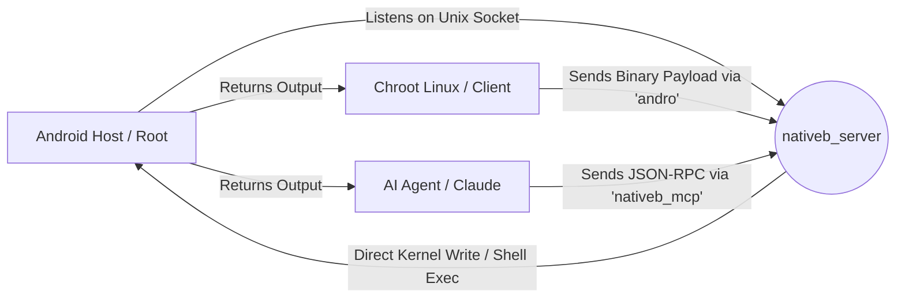

# Native-Bridge

> **Break the Chroot isolation. Control Android Host directly from your Linux Environment.**

[-blue?style=flat-square)](https://en.wikipedia.org/wiki/C_(programming_language))
[](LICENSE)
[](https://developer.android.com/)
[](https://modelcontextprotocol.io/)

**Native-Bridge** establishes a direct, high-performance communication channel between a Chrooted Linux Environment (like Ubuntu/Debian via Termux) and the Android Host System. 

Originally written in Rust, this project has been **completely rewritten in pure C**. It now boasts a zero-dependency architecture, a tiny memory footprint (a few KBs), dynamic path configurations, and AI Agent support via the Model Context Protocol (MCP).

## Why Native-Bridge?

By default, a Chroot Environment is strictly isolated. It lives in a separate filesystem "jail" and **cannot access the Android System**, hardware inputs, or global settings.

**Native-Bridge solves this by creating a secure tunnel (Unix Domain Socket) that allows you to:**

- **Bypass Isolation:** Execute commands on the Android System directly from your Chroot Terminal.
- **Direct Kernel Injection:** Perform high-speed input injection (Tap/Swipe) by writing directly to `/dev/input/event*`, bypassing the heavy Android Framework (Java) for near zero-latency.
- **Zero Dependencies:** No heavy binaries, no external libraries. Uses a custom lightweight TLV binary protocol.
- **Dynamic Configuration:** **No more hardcoded paths!** Configure sockets and touch devices on the fly via CLI arguments and Environment Variables.
- **AI-Ready:** Includes an optional MCP (Model Context Protocol) server, allowing AI Agents (like Claude or Cursor) to directly interact with your Android device.

## Architecture



## Prerequisites

- **Rooted Android Device** (KernelSu / Magisk / APatch).
- **Chroot Environment** (Ubuntu, Debian, Kali, Fedora, etc).
- **GCC & Make** (`sudo apt install build-essential`).

## Building from Source

Since we use pure C (POSIX standard), compiling is extremely fast and straightforward.

### 1. Standard Build
Build the Server (`nativeb_server`) and the Client CLI (`andro`).
```bash
make
```

### 2. Build with MCP (AI Support)
If you want to allow AI Agents to control your Android device, build the optional MCP target:
```bash
make mcp
```

### 3. Clean Build
```bash
make clean
```

All compiled binaries will be located in the `build/` directory.

---

## Installation & Setup

### 1. Setup Server (Android Host)
The server must run on the Android Host (outside the Chroot) as root. 

First, copy the compiled server binary to a location Android can execute:
```bash
# [Inside Chroot Terminal]
cp build/nativeb_server /tmp/nativeb_server
```

Now, open a **separate terminal** (Termux or ADB Shell) that is **NOT** inside Chroot:
```bash
# [Inside Android Termux/ADB]
su
cp /data/local/tmp/chrootubuntu/tmp/nativeb_server /data/local/tmp/
chmod +x /data/local/tmp/nativeb_server

# Run the server in the background
# -s : Path to the shared socket (MUST be inside your chroot directory)
# -d : (Optional) Path to your touchscreen event device
/data/local/tmp/nativeb_server -s /data/local/tmp/chrootubuntu/tmp/bridge.sock -d /dev/input/event2 &
```
*Tip: Use `getevent -pl` in Termux to find your correct `/dev/input/eventX` for the touchscreen.*

### 2. Setup Client (Chroot)
The client lives inside your Chroot environment.

```bash
# [Inside Chroot Terminal]
sudo cp build/andro /usr/local/bin/andro

# Tell the client where the socket is by adding this to your ~/.bashrc or ~/.zshrc
echo 'export BRIDGE_SOCKET="/tmp/bridge.sock"' >> ~/.bashrc
source ~/.bashrc
```

---

## Usage

Simply call `andro` followed by the subcommand.

### 1. General Execution
Run any command as if you were in the Android Root Shell.
```bash
# Check User Identity
andro -e id

# Check Battery Status
andro -e dumpsys battery

# Capture Screenshot to Chroot
andro -e screencap -p > /home/user/capture.png

# Stream Logcat Real-Time
andro -s logcat
```

### 2. Direct Input (Kernel Injection)
*Requires the server to be started with the `-d /dev/input/eventX` flag.*

```bash
# Tap (Instant click at X=500, Y=500)
andro tap 500 500

# Swipe (Scroll down)
# Format: swipe <x1> <y1> <x2> <y2> <duration_ms>
andro swipe 500 1500 500 500 300
```

### 3. Utilities
```bash
# Check if server is alive
andro ping
```

---

## MCP Integration (For AI Agents)

Native-Bridge includes `nativeb_mcp`, a zero-dependency JSON-RPC server that translates AI commands into Android Host actions safely. 

To use it with **Claude Desktop** or **Cursor**, add the following to your MCP configuration file (e.g., `claude_desktop_config.json`):

```json
{
  "mcpServers": {
    "android-bridge": {
      "command": "/path/to/your/chroot/build/nativeb_mcp",
      "env": {
        "BRIDGE_SOCKET": "/tmp/bridge.sock"
      }
    }
  }
}
```
*Security Note: The MCP server includes a built-in blacklist blocking destructive commands (e.g., `rm`, `reboot`, `dd`, `su`).*

## Troubleshooting

**"Failed to connect to /tmp/bridge.sock"**
- Ensure `nativeb_server` is running on the Android Host.
- Ensure the `BRIDGE_SOCKET` environment variable in your Chroot matches the `-s` path you provided to the server.

**Tap/Swipe not working**
- Did you pass the `-d` argument when starting the server?
- Is it the correct event number? Use `getevent -pl` to verify which event ID corresponds to your touchscreen.

## License

This project is licensed under the Apache License 2.0 - see the[LICENSE](LICENSE) file for details.